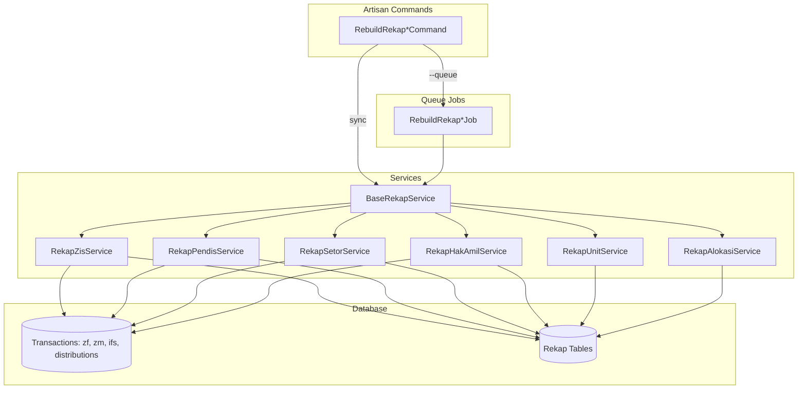

# Design Document

## Overview

Dokumen ini menjelaskan desain teknis untuk optimasi Artisan Commands rebuild rekapitulasi pada sistem SISFOZIS. Optimasi mencakup implementasi chunking, queue-based processing, batch database operations, dan standardisasi interface command.

Arsitektur baru akan memisahkan concerns antara:

-   **Commands**: Handle CLI interface dan dispatching
-   **Jobs**: Handle background processing per chunk
-   **Services**: Handle business logic dan database operations
-   **Traits**: Shared functionality across services

## Architecture



## Components and Interfaces

### 1. BaseRekapService (Abstract Class)

```php
<?php

namespace App\Services;

use Carbon\Carbon;
use Illuminate\Support\Collection;
use Illuminate\Support\Facades\DB;
use Illuminate\Support\Facades\Log;

abstract class BaseRekapService
{
    protected int $chunkSize = 50;
    protected string $rekapTable;
    protected string $periodColumn = 'period';
    protected string $periodDateColumn = 'period_date';

    /**
     * Set chunk size for processing
     */
    public function setChunkSize(int $size): self
    {
        $this->chunkSize = $size;
        return $this;
    }

    /**
     * Rebuild rekap for given parameters
     */
    abstract public function rebuild(
        string $unitId = 'all',
        string $periode = 'all',
        ?Carbon $startDate = null,
        ?Carbon $endDate = null
    ): array;

    /**
     * Get aggregated data for a unit and date range
     */
    abstract protected function getAggregatedData(
        int $unitId,
        Carbon $startDate,
        Carbon $endDate
    ): array;

    /**
     * Bulk upsert rekap records
     */
    protected function bulkUpsert(array $records): int
    {
        if (empty($records)) {
            return 0;
        }

        return DB::table($this->rekapTable)->upsert(
            $records,
            ['unit_id', $this->periodColumn, $this->periodDateColumn],
            array_keys($records[0])
        );
    }

    /**
     * Process units in chunks
     */
    protected function processInChunks(
        $unitQuery,
        callable $processor
    ): array {
        $results = [
            'processed' => 0,
            'errors' => []
        ];

        $unitQuery->chunk($this->chunkSize, function ($units) use ($processor, &$results) {
            foreach ($units as $unit) {
                try {
                    $processor($unit);
                    $results['processed']++;
                } catch (\Exception $e) {
                    $results['errors'][] = [
                        'unit_id' => $unit->id,
                        'error' => $e->getMessage()
                    ];
                    Log::error("Rebuild error for unit {$unit->id}: " . $e->getMessage());
                }
            }

            // Release memory after each chunk
            gc_collect_cycles();
        });

        return $results;
    }
}
```

### 2. Optimized RekapZisService

```php
<?php

namespace App\Services;

use App\Models\UnitZis;
use App\Models\RekapZis;
use Carbon\Carbon;
use Illuminate\Support\Facades\DB;

class RekapZisService extends BaseRekapService
{
    protected string $rekapTable = 'rekap_zis';

    public function rebuild(
        string $unitId = 'all',
        string $periode = 'all',
        ?Carbon $startDate = null,
        ?Carbon $endDate = null
    ): array {
        $startDate = $startDate ?? Carbon::now()->subDays(30);
        $endDate = $endDate ?? Carbon::now();

        $unitQuery = $unitId === 'all'
            ? UnitZis::query()
            : UnitZis::where('id', $unitId);

        return $this->processInChunks($unitQuery, function ($unit) use ($periode, $startDate, $endDate) {
            $this->rebuildForUnit($unit->id, $periode, $startDate, $endDate);
        });
    }

    protected function rebuildForUnit(
        int $unitId,
        string $periode,
        Carbon $startDate,
        Carbon $endDate
    ): void {
        $records = [];

        if ($periode === 'all' || $periode === 'harian') {
            $records = array_merge($records, $this->buildDailyRecords($unitId, $startDate, $endDate));
        }

        if ($periode === 'all' || $periode === 'bulanan') {
            $records = array_merge($records, $this->buildMonthlyRecords($unitId, $startDate, $endDate));
        }

        if ($periode === 'all' || $periode === 'tahunan') {
            $records = array_merge($records, $this->buildYearlyRecords($unitId, $startDate, $endDate));
        }

        if (!empty($records)) {
            $this->bulkUpsert($records);
        }
    }

    /**
     * Build daily records using single aggregated query
     */
    protected function buildDailyRecords(int $unitId, Carbon $startDate, Carbon $endDate): array
    {
        // Single query to get all daily aggregates
        $dailyData = $this->getAggregatedData($unitId, $startDate, $endDate, 'daily');

        return collect($dailyData)->map(function ($data) use ($unitId) {
            return [
                'unit_id' => $unitId,
                'period' => 'harian',
                'period_date' => $data->period_date,
                'total_zf_muzakki' => $data->total_zf_muzakki ?? 0,
                'total_zf_rice' => $data->total_zf_rice ?? 0,
                'total_zf_amount' => $data->total_zf_amount ?? 0,
                'total_zm_muzakki' => $data->total_zm_muzakki ?? 0,
                'total_zm_amount' => $data->total_zm_amount ?? 0,
                'total_ifs_munfiq' => $data->total_ifs_munfiq ?? 0,
                'total_ifs_amount' => $data->total_ifs_amount ?? 0,
                'created_at' => now(),
                'updated_at' => now(),
            ];
        })->toArray();
    }

    protected function getAggregatedData(int $unitId, Carbon $startDate, Carbon $endDate, string $groupBy = 'daily'): array
    {
        $dateFormat = match($groupBy) {
            'daily' => "DATE(trx_date)",
            'monthly' => "DATE_TRUNC('month', trx_date)",
            'yearly' => "DATE_TRUNC('year', trx_date)",
        };

        // Aggregated ZF data
        $zfData = DB::table('zfs')
            ->where('unit_id', $unitId)
            ->whereBetween('trx_date', [$startDate, $endDate])
            ->selectRaw("{$dateFormat} as period_date")
            ->selectRaw('SUM(total_muzakki) as total_zf_muzakki')
            ->selectRaw('SUM(zf_rice) as total_zf_rice')
            ->selectRaw('SUM(zf_amount) as total_zf_amount')
            ->groupByRaw($dateFormat)
            ->get()
            ->keyBy('period_date');

        // Aggregated ZM data
        $zmData = DB::table('zms')
            ->where('unit_id', $unitId)
            ->whereBetween('trx_date', [$startDate, $endDate])
            ->selectRaw("{$dateFormat} as period_date")
            ->selectRaw('COUNT(DISTINCT muzakki_name) as total_zm_muzakki')
            ->selectRaw('SUM(amount) as total_zm_amount')
            ->groupByRaw($dateFormat)
            ->get()
            ->keyBy('period_date');

        // Aggregated IFS data
        $ifsData = DB::table('ifs')
            ->where('unit_id', $unitId)
            ->whereBetween('trx_date', [$startDate, $endDate])
            ->selectRaw("{$dateFormat} as period_date")
            ->selectRaw('COUNT(DISTINCT munfiq_name) as total_ifs_munfiq')
            ->selectRaw('SUM(amount) as total_ifs_amount')
            ->groupByRaw($dateFormat)
            ->get()
            ->keyBy('period_date');

        // Merge all data by period_date
        $allDates = $zfData->keys()
            ->merge($zmData->keys())
            ->merge($ifsData->keys())
            ->unique();

        return $allDates->map(function ($date) use ($zfData, $zmData, $ifsData) {
            return (object) [
                'period_date' => $date,
                'total_zf_muzakki' => $zfData->get($date)?->total_zf_muzakki ?? 0,
                'total_zf_rice' => $zfData->get($date)?->total_zf_rice ?? 0,
                'total_zf_amount' => $zfData->get($date)?->total_zf_amount ?? 0,
                'total_zm_muzakki' => $zmData->get($date)?->total_zm_muzakki ?? 0,
                'total_zm_amount' => $zmData->get($date)?->total_zm_amount ?? 0,
                'total_ifs_munfiq' => $ifsData->get($date)?->total_ifs_munfiq ?? 0,
                'total_ifs_amount' => $ifsData->get($date)?->total_ifs_amount ?? 0,
            ];
        })->toArray();
    }
}
```

### 3. RebuildRekapJob (Queue Job)

```php
<?php

namespace App\Jobs;

use App\Services\BaseRekapService;
use Carbon\Carbon;
use Illuminate\Bus\Queueable;
use Illuminate\Contracts\Queue\ShouldQueue;
use Illuminate\Foundation\Bus\Dispatchable;
use Illuminate\Queue\InteractsWithQueue;
use Illuminate\Queue\SerializesModels;
use Illuminate\Support\Facades\Log;

class RebuildRekapJob implements ShouldQueue
{
    use Dispatchable, InteractsWithQueue, Queueable, SerializesModels;

    public int $tries = 3;
    public int $timeout = 3600; // 1 hour

    public function __construct(
        public string $serviceClass,
        public array $unitIds,
        public string $periode,
        public ?string $startDate,
        public ?string $endDate,
        public int $chunkSize = 50
    ) {}

    public function handle(): void
    {
        $service = app($this->serviceClass);
        $service->setChunkSize($this->chunkSize);

        $startDate = $this->startDate ? Carbon::parse($this->startDate) : null;
        $endDate = $this->endDate ? Carbon::parse($this->endDate) : null;

        foreach ($this->unitIds as $unitId) {
            try {
                $service->rebuild($unitId, $this->periode, $startDate, $endDate);
                Log::info("Rebuilt rekap for unit {$unitId}");
            } catch (\Exception $e) {
                Log::error("Failed to rebuild rekap for unit {$unitId}: " . $e->getMessage());
                throw $e;
            }
        }
    }
}
```

### 4. Standardized Command Interface

```php
<?php

namespace App\Console\Commands;

use App\Jobs\RebuildRekapJob;
use App\Models\UnitZis;
use Carbon\Carbon;
use Illuminate\Console\Command;

abstract class BaseRebuildCommand extends Command
{
    protected string $serviceClass;
    protected string $rekapType;

    protected function getSignatureOptions(): string
    {
        return '{--unit=all : ID unit atau "all" untuk semua unit}
                {--start= : Tanggal mulai format Y-m-d}
                {--end= : Tanggal akhir format Y-m-d}
                {--periode=all : Periode (harian, bulanan, tahunan, all)}
                {--chunk-size=50 : Jumlah unit per batch}
                {--queue : Jalankan sebagai background job}';
    }

    public function handle(): int
    {
        $unitOption = $this->option('unit');
        $startDate = $this->option('start');
        $endDate = $this->option('end');
        $periode = $this->option('periode');
        $chunkSize = (int) $this->option('chunk-size');
        $useQueue = $this->option('queue');

        // Validate inputs
        if (!$this->validateInputs($startDate, $endDate, $periode)) {
            return 1;
        }

        $parsedStartDate = $startDate ? Carbon::parse($startDate) : Carbon::now()->subDays(30);
        $parsedEndDate = $endDate ? Carbon::parse($endDate) : Carbon::now();

        $this->info("Membangun ulang {$this->rekapType} dari {$parsedStartDate->format('Y-m-d')} sampai {$parsedEndDate->format('Y-m-d')}");

        if ($useQueue) {
            return $this->dispatchToQueue($unitOption, $periode, $startDate, $endDate, $chunkSize);
        }

        return $this->runSync($unitOption, $periode, $parsedStartDate, $parsedEndDate, $chunkSize);
    }

    protected function dispatchToQueue(
        string $unitOption,
        string $periode,
        ?string $startDate,
        ?string $endDate,
        int $chunkSize
    ): int {
        $unitIds = $this->getUnitIds($unitOption);
        $chunks = array_chunk($unitIds, $chunkSize);

        foreach ($chunks as $index => $chunk) {
            RebuildRekapJob::dispatch(
                $this->serviceClass,
                $chunk,
                $periode,
                $startDate,
                $endDate,
                $chunkSize
            )->onQueue('rebuild');

            $this->info("Dispatched job for chunk " . ($index + 1) . " of " . count($chunks));
        }

        $this->info("Total {$this->rekapType} rebuild jobs dispatched: " . count($chunks));
        return 0;
    }

    protected function runSync(
        string $unitOption,
        string $periode,
        Carbon $startDate,
        Carbon $endDate,
        int $chunkSize
    ): int {
        $service = app($this->serviceClass);
        $service->setChunkSize($chunkSize);

        $startTime = microtime(true);

        $result = $service->rebuild($unitOption, $periode, $startDate, $endDate);

        $duration = round(microtime(true) - $startTime, 2);

        $this->newLine();
        $this->info("Proses selesai dalam {$duration} detik");
        $this->info("Unit diproses: {$result['processed']}");

        if (!empty($result['errors'])) {
            $this->warn("Errors: " . count($result['errors']));
            foreach ($result['errors'] as $error) {
                $this->error("Unit {$error['unit_id']}: {$error['error']}");
            }
        }

        return empty($result['errors']) ? 0 : 1;
    }

    protected function validateInputs(?string $startDate, ?string $endDate, string $periode): bool
    {
        if ($startDate && !$this->isValidDate($startDate)) {
            $this->error('Format tanggal mulai tidak valid. Gunakan format Y-m-d');
            return false;
        }

        if ($endDate && !$this->isValidDate($endDate)) {
            $this->error('Format tanggal akhir tidak valid. Gunakan format Y-m-d');
            return false;
        }

        $allowedPeriodes = ['harian', 'bulanan', 'tahunan', 'all'];
        if (!in_array($periode, $allowedPeriodes)) {
            $this->error('Periode tidak valid. Pilih: ' . implode(', ', $allowedPeriodes));
            return false;
        }

        return true;
    }

    protected function isValidDate(string $date): bool
    {
        return \DateTime::createFromFormat('Y-m-d', $date) !== false;
    }

    protected function getUnitIds(string $unitOption): array
    {
        if ($unitOption === 'all') {
            return UnitZis::pluck('id')->toArray();
        }
        return [(int) $unitOption];
    }
}
```

## Data Models

### Database Indexes (Migration)

```php
<?php

use Illuminate\Database\Migrations\Migration;
use Illuminate\Database\Schema\Blueprint;
use Illuminate\Support\Facades\Schema;

return new class extends Migration
{
    public function up(): void
    {
        // Composite indexes for transaction tables
        Schema::table('zfs', function (Blueprint $table) {
            $table->index(['unit_id', 'trx_date'], 'zfs_unit_trx_date_idx');
        });

        Schema::table('zms', function (Blueprint $table) {
            $table->index(['unit_id', 'trx_date'], 'zms_unit_trx_date_idx');
        });

        Schema::table('ifs', function (Blueprint $table) {
            $table->index(['unit_id', 'trx_date'], 'ifs_unit_trx_date_idx');
        });

        Schema::table('distributions', function (Blueprint $table) {
            $table->index(['unit_id', 'trx_date'], 'distributions_unit_trx_date_idx');
        });

        // Unique composite indexes for rekap tables
        Schema::table('rekap_zis', function (Blueprint $table) {
            $table->unique(['unit_id', 'period', 'period_date'], 'rekap_zis_unique_idx');
        });

        Schema::table('rekap_pendis', function (Blueprint $table) {
            $table->unique(['unit_id', 'periode', 'periode_date'], 'rekap_pendis_unique_idx');
        });

        Schema::table('rekap_setor', function (Blueprint $table) {
            $table->unique(['unit_id', 'periode', 'periode_date'], 'rekap_setor_unique_idx');
        });

        Schema::table('rekap_hak_amil', function (Blueprint $table) {
            $table->unique(['unit_id', 'periode', 'periode_date'], 'rekap_hak_amil_unique_idx');
        });
    }

    public function down(): void
    {
        Schema::table('zfs', fn (Blueprint $table) => $table->dropIndex('zfs_unit_trx_date_idx'));
        Schema::table('zms', fn (Blueprint $table) => $table->dropIndex('zms_unit_trx_date_idx'));
        Schema::table('ifs', fn (Blueprint $table) => $table->dropIndex('ifs_unit_trx_date_idx'));
        Schema::table('distributions', fn (Blueprint $table) => $table->dropIndex('distributions_unit_trx_date_idx'));
        Schema::table('rekap_zis', fn (Blueprint $table) => $table->dropIndex('rekap_zis_unique_idx'));
        Schema::table('rekap_pendis', fn (Blueprint $table) => $table->dropIndex('rekap_pendis_unique_idx'));
        Schema::table('rekap_setor', fn (Blueprint $table) => $table->dropIndex('rekap_setor_unique_idx'));
        Schema::table('rekap_hak_amil', fn (Blueprint $table) => $table->dropIndex('rekap_hak_amil_unique_idx'));
    }
};
```

## Correctness Properties

_A property is a characteristic or behavior that should hold true across all valid executions of a system-essentially, a formal statement about what the system should do. Properties serve as the bridge between human-readable specifications and machine-verifiable correctness guarantees._

Based on the prework analysis, the following correctness properties have been identified:

### Property 1: Chunking preserves total unit count

_For any_ set of units and any chunk size, the total number of units processed across all chunks SHALL equal the original unit count.
**Validates: Requirements 1.1**

### Property 2: Queue job count matches chunk calculation

_For any_ number of units N and chunk size C, the number of dispatched queue jobs SHALL equal ceil(N/C).
**Validates: Requirements 2.2**

### Property 3: Batch query count is constant per unit

_For any_ date range, the number of database queries for aggregating transaction data for a single unit SHALL be constant (not proportional to the number of days).
**Validates: Requirements 3.1**

### Property 4: Bulk upsert receives all records

_For any_ rebuild operation on a unit, the bulk upsert function SHALL receive all generated rekap records in a single call per period type.
**Validates: Requirements 3.2**

### Property 5: Input validation rejects invalid formats

_For any_ date string not matching Y-m-d format OR any periode value not in [harian, bulanan, tahunan, all], the command SHALL return error code 1 and display error message.
**Validates: Requirements 5.2, 5.3**

### Property 6: Command interface consistency

_For any_ rebuild command (ZIS, Pendis, Setor, HakAmil, Unit, Alokasi), the command SHALL accept the same set of options: --unit, --start, --end, --periode, --chunk-size, --queue.
**Validates: Requirements 5.1**

### Property 7: Error isolation preserves other units

_For any_ batch of units where one unit fails during processing, all other units in the batch SHALL complete successfully and their data SHALL be persisted.
**Validates: Requirements 4.4, 6.4**

### Property 8: Daily processing independence

_For any_ daily rebuild operation, the system SHALL NOT trigger automatic monthly or yearly recalculation.
**Validates: Requirements 6.2**

## Error Handling

### Command Level

-   Invalid date format: Return exit code 1 with descriptive error message
-   Invalid periode value: Return exit code 1 listing valid options
-   Unit not found: Return exit code 1 with "Unit tidak ditemukan" message
-   Database connection failure: Log error and return exit code 1

### Service Level

-   Individual unit failure: Log error, continue processing other units, include in final error summary
-   Transaction failure: Rollback only affected unit's transaction, not entire batch
-   Memory warning: Log warning but continue processing (PHP will handle OOM)

### Job Level

-   Job failure: Retry up to 3 times with exponential backoff
-   All retries exhausted: Mark job as failed, log detailed error
-   Timeout: Job timeout set to 1 hour, will be killed and retried if exceeded

### Error Response Format

```php
[
    'processed' => int,      // Number of successfully processed units
    'errors' => [
        [
            'unit_id' => int,
            'periode' => string,  // Optional, if error is periode-specific
            'error' => string,    // Error message
        ],
        // ...
    ]
]
```

## Testing Strategy

### Testing Framework

-   **Pest PHP 3** - Primary testing framework (as specified in project tech stack)
-   **fast-check** equivalent: Use Pest's data providers for property-based testing patterns

### Unit Tests

1. **BaseRekapService Tests**

    - Test `setChunkSize()` correctly sets chunk size
    - Test `bulkUpsert()` calls DB::upsert with correct parameters
    - Test `processInChunks()` processes all units

2. **Command Tests**

    - Test `validateInputs()` with valid/invalid dates
    - Test `validateInputs()` with valid/invalid periode values
    - Test `getUnitIds()` returns correct IDs for 'all' and specific unit

3. **Job Tests**
    - Test job has correct `$tries` value (3)
    - Test job has correct `$timeout` value (3600)
    - Test job calls service with correct parameters

### Property-Based Tests

Property tests MUST be annotated with the format: `**Feature: rebuild-commands-optimization, Property {number}: {property_text}**`

Each property from the Correctness Properties section will have a corresponding property-based test:

1. **Property 1 Test**: Generate random unit counts and chunk sizes, verify total processed equals input count
2. **Property 2 Test**: Generate random unit counts and chunk sizes, verify job count equals ceil(N/C)
3. **Property 3 Test**: Generate random date ranges, count queries, verify constant count
4. **Property 5 Test**: Generate random invalid date strings and periode values, verify rejection
5. **Property 6 Test**: Verify all command classes have identical signature options
6. **Property 7 Test**: Simulate failure for random unit in batch, verify others succeed
7. **Property 8 Test**: Run daily rebuild, verify no monthly/yearly methods called

### Integration Tests

1. **Full Rebuild Flow**

    - Test complete rebuild for single unit
    - Verify rekap records are created correctly
    - Verify data matches source transactions

2. **Queue Integration**
    - Test job dispatch with --queue flag
    - Verify jobs are created on correct queue
    - Test job execution completes successfully

### Test Configuration

-   Property-based tests: Minimum 100 iterations per property
-   Use database transactions for test isolation
-   Mock external services (queue, logging) where appropriate
