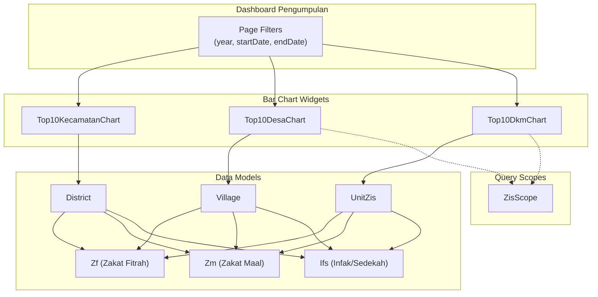

# Design Document

## Overview

Fitur ini menambahkan tiga widget bar chart pada Dashboard Pengumpulan:

1. **Top10KecamatanChart** - Menampilkan 10 kecamatan dengan penerimaan ZIS tertinggi (hanya untuk super_admin dan tim_sisfo)
2. **Top10DesaChart** - Menampilkan 10 desa dengan penerimaan ZIS tertinggi (menggunakan ZisScope)
3. **Top10DkmChart** - Menampilkan 10 UPZ DKM dengan penerimaan ZIS tertinggi (menggunakan ZisScope)

Semua widget menggunakan Filament ChartWidget dengan tipe bar chart horizontal dan terintegrasi dengan page filter yang sudah ada.

## Architecture



## Components and Interfaces

### 1. Top10KecamatanChart Widget

```php
class Top10KecamatanChart extends ChartWidget
{
    use InteractsWithPageFilters;

    // Visibility: super_admin, tim_sisfo only
    public static function canView(): bool;

    // Returns bar chart data with top 10 districts
    protected function getData(): array;

    // Chart type: horizontal bar
    protected function getType(): string;

    // Query helpers
    private function getTopKecamatanData(): Collection;
    private function calculateTotalZis(District $district): float;
}
```

### 2. Top10DesaChart Widget

```php
class Top10DesaChart extends ChartWidget
{
    use InteractsWithPageFilters;

    // Returns bar chart data with top 10 villages (filtered by ZisScope)
    protected function getData(): array;

    // Chart type: horizontal bar
    protected function getType(): string;

    // Query helpers with ZisScope applied
    private function getTopDesaData(): Collection;
    private function calculateTotalZis(Village $village): float;
}
```

### 3. Top10DkmChart Widget

```php
class Top10DkmChart extends ChartWidget
{
    use InteractsWithPageFilters;

    // Returns bar chart data with top 10 UPZ DKM (filtered by ZisScope)
    protected function getData(): array;

    // Chart type: horizontal bar
    protected function getType(): string;

    // Query helpers with ZisScope and DKM category filter
    private function getTopDkmData(): Collection;
    private function calculateTotalZis(UnitZis $unit): float;
}
```

### Dashboard Integration

```php
// Dashboard.php - getWidgets() method update
public function getWidgets(): array
{
    return [
        \App\Filament\Widgets\TotalZisOverview::class,
        \App\Filament\Widgets\AllZisOverview::class,
        \App\Filament\Widgets\MuzakiChart::class,
        \App\Filament\Widgets\ZisChart::class,
        \App\Filament\Widgets\Top10KecamatanChart::class,  // New
        \App\Filament\Widgets\Top10DesaChart::class,       // New
        \App\Filament\Widgets\Top10DkmChart::class,        // New
    ];
}
```

## Data Models

### Total ZIS Calculation

Total ZIS dihitung dengan mengagregasi:

-   `zf_amount` dari tabel `zfs` (Zakat Fitrah dalam bentuk uang)
-   `amount` dari tabel `zms` (Zakat Maal)
-   `amount` dari tabel `ifs` (Infak/Sedekah)

### Query Pattern untuk Kecamatan

```sql
SELECT districts.*,
    (SELECT COALESCE(SUM(zf_amount), 0) FROM zfs
     JOIN unit_zis ON zfs.unit_id = unit_zis.id
     WHERE unit_zis.district_id = districts.id
     AND [date_filters]) +
    (SELECT COALESCE(SUM(amount), 0) FROM zms
     JOIN unit_zis ON zms.unit_id = unit_zis.id
     WHERE unit_zis.district_id = districts.id
     AND [date_filters]) +
    (SELECT COALESCE(SUM(amount), 0) FROM ifs
     JOIN unit_zis ON ifs.unit_id = unit_zis.id
     WHERE unit_zis.district_id = districts.id
     AND [date_filters]) as total_zis
FROM districts
HAVING total_zis > 0
ORDER BY total_zis DESC
LIMIT 10
```

### Query Pattern untuk Desa (dengan ZisScope)

```sql
SELECT villages.*,
    [total_zis_calculation] as total_zis
FROM villages
WHERE [zis_scope_conditions]
HAVING total_zis > 0
ORDER BY total_zis DESC
LIMIT 10
```

### Query Pattern untuk UPZ DKM (dengan ZisScope)

```sql
SELECT unit_zis.*,
    [total_zis_calculation] as total_zis
FROM unit_zis
WHERE category_id = [DKM_CATEGORY_ID]
AND [zis_scope_conditions]
HAVING total_zis > 0
ORDER BY total_zis DESC
LIMIT 10
```

## Correctness Properties

_A property is a characteristic or behavior that should hold true across all valid executions of a system-essentially, a formal statement about what the system should do. Properties serve as the bridge between human-readable specifications and machine-verifiable correctness guarantees._

### Property 1: Top 10 ranking is correctly sorted descending

_For any_ set of districts/villages/units with ZIS data, the returned top 10 list SHALL be sorted by total_zis in descending order (highest first)
**Validates: Requirements 1.1, 2.1, 3.1**

### Property 2: Zero ZIS exclusion

_For any_ district/village/unit with total_zis equal to zero, that entity SHALL NOT appear in the top 10 results
**Validates: Requirements 1.3, 2.3, 3.3**

### Property 3: Date filter application consistency

_For any_ date filter combination (year, startDate, endDate), the calculated total_zis SHALL only include transactions within the specified date range
**Validates: Requirements 1.2, 2.2, 3.2, 5.2**

### Property 4: Total ZIS calculation accuracy

_For any_ entity (district/village/unit), the total_zis SHALL equal the sum of zf_amount + zm_amount + ifs_amount for all related transactions
**Validates: Requirements 5.1**

### Property 5: Role-based visibility for Kecamatan widget

_For any_ user without super_admin or tim_sisfo role, the Top10KecamatanChart widget SHALL return false from canView()
**Validates: Requirements 1.5**

### Property 6: ZisScope application for Desa widget

_For any_ user with upz_kecamatan role, the Top10DesaChart SHALL only return villages within the user's assigned district
**Validates: Requirements 2.5**

### Property 7: ZisScope application for DKM widget

_For any_ user with upz_kecamatan role, the Top10DkmChart SHALL only return UPZ DKM units within the user's assigned district
**Validates: Requirements 3.5**

### Property 8: DKM category filter

_For any_ result in Top10DkmChart, the unit SHALL have category_id corresponding to DKM category
**Validates: Requirements 3.6**

## Error Handling

| Scenario               | Handling                                          |
| ---------------------- | ------------------------------------------------- |
| No ZIS data exists     | Display empty chart with "Tidak ada data" message |
| Database query fails   | Log error, display fallback empty state           |
| Invalid filter values  | Use default values (current year, no date range)  |
| User not authenticated | Widget not rendered (handled by Filament)         |

## Testing Strategy

### Dual Testing Approach

Testing akan menggunakan kombinasi unit tests dan property-based tests:

1. **Unit Tests** - Untuk memverifikasi contoh spesifik dan edge cases
2. **Property-Based Tests** - Untuk memverifikasi properti universal yang harus berlaku untuk semua input

### Property-Based Testing Library

Menggunakan **Pest PHP** dengan plugin **pest-plugin-faker** untuk property-based testing.

### Test Structure

```
tests/
├── Unit/
│   └── Widgets/
│       ├── Top10KecamatanChartTest.php
│       ├── Top10DesaChartTest.php
│       └── Top10DkmChartTest.php
└── Feature/
    └── Dashboard/
        └── TopZisWidgetsTest.php
```

### Property Test Annotations

Setiap property-based test HARUS di-tag dengan format:

```php
/**
 * **Feature: top-zis-bar-chart-widgets, Property {number}: {property_text}**
 */
```

### Test Coverage

| Property   | Test Type      | Description                    |
| ---------- | -------------- | ------------------------------ |
| Property 1 | Property-based | Verify descending sort order   |
| Property 2 | Property-based | Verify zero exclusion          |
| Property 3 | Property-based | Verify date filter application |
| Property 4 | Property-based | Verify total calculation       |
| Property 5 | Property-based | Verify role visibility         |
| Property 6 | Property-based | Verify ZisScope for villages   |
| Property 7 | Property-based | Verify ZisScope for DKM        |
| Property 8 | Property-based | Verify DKM category filter     |
